

 

**Two Late Han to Jin Bows from Gansu and Khotan  
Stephen Selby. © Stephen Selby, 2002  
(originally published as ATARN Newsletters in April and September
2002)**

A desert tomb in Jiayuguan, Gansu, Western China, has recently yielded
up a wooden, model bow. Bede Dwyer and Grózer Csaba, who have both
pre-viewed the pictures, consider that this bow is a full-scale model of
a horn and sinew bow. The bow is in light-weight wood carved from two
pieces. The two pieces unite at a splice at the grip. There is no sinew
visible on it, and just a little birch bark remains adhering to the back
of the bow.

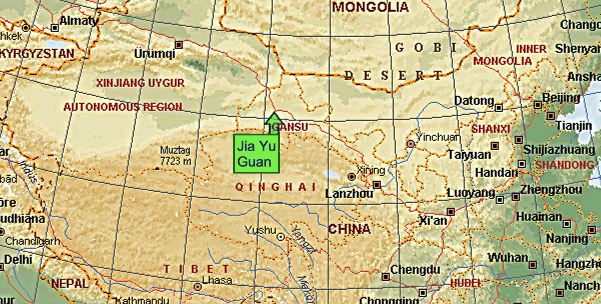  
*The bow comes from near Jiayuguan in Gansu, China. *  
This map is reproduced from the Microsoft Encarta World Atlas in
accordance with the   
licence conditions concerning use in free flyers not sold in any form or
context. **Copyright reserved.****

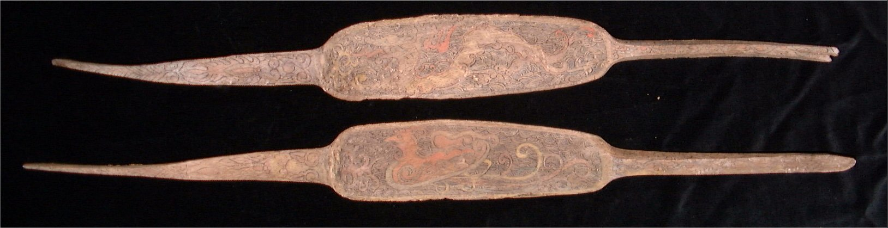  
*The two wooden components, with the grip splice to the right and the
tips to the left*

Above is a photograph of the two parts of the bow. The main working part
of the limb forms a broad plate, bearing a painted design on each.

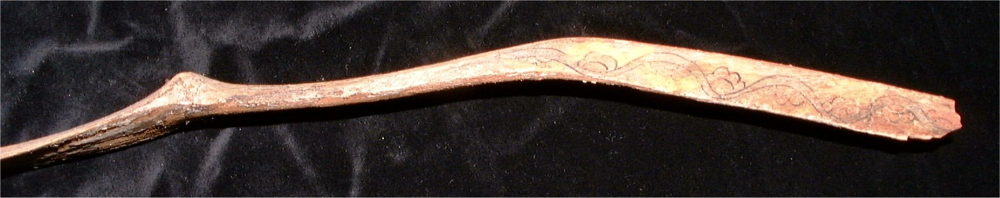  
*Side view of one of the siyahs. The tip is broken off about 5cm short
of the end on the right.*

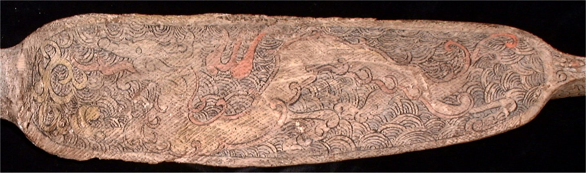  
*Dragon painted on one of the limbs (belly side) in black, white, red
and ochre.*

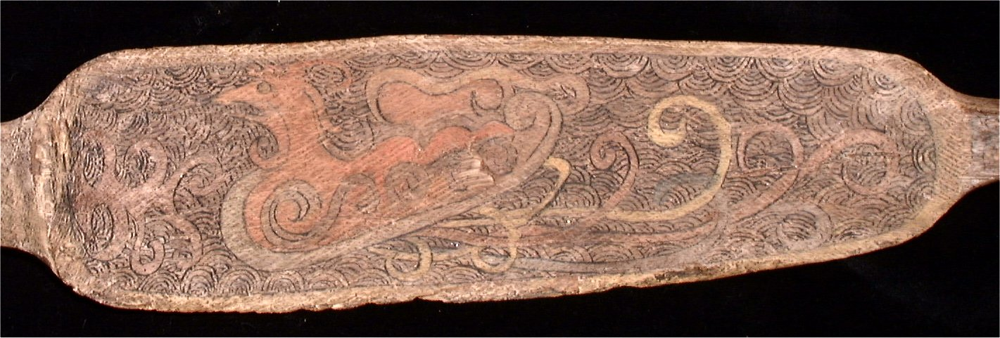  
*'Phoenix' painted on one of the limbs (belly side) in black, white, red
and ochre.*

These dragon and phoenix designs should not be interpreted in terms of
modern Chinese symbolism. This bow came  from a group of graves dating
from the Wei/Eastern Jin period, around 260CE. At that time, the dragon
was the 'black dragon' -- a Daoist symbol of the East, while the bird
was the 'red bird' -- denoting the South. Both symbols were derived from
constellations, and continued in use from the Han dynasty. Such images
would allow the soul of the deceased to rest in
peace.

|                                       |                                   |
| ------------------------------------- | --------------------------------- |
|  |  |

*The black dragon and red bird from Eastern Jin tomb tiles.*

  
*Painted cicada design from the siyah of the bow*

The cicada design on the limb also represents a hold-over from the Han
Dynasty, representing a return to life for the deceased (because the
cicada was thought to return to life in springtime from a dry, lifeless
state in the winter.)

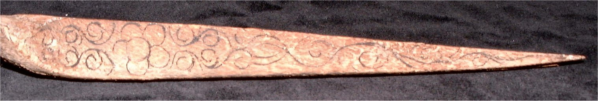  
*Floral design on the side of the grip splice.*

The flower on the grip may be *'hai tang'* (crab-apple) which rhymed
with the word for 'high rank'.

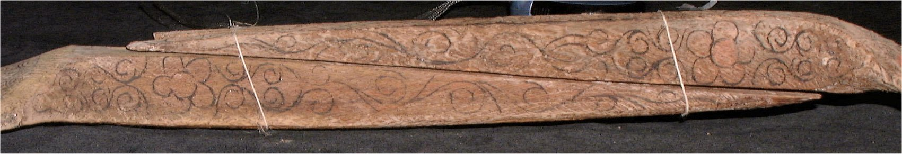  
*The two splices placed together to form the core of the grip.*

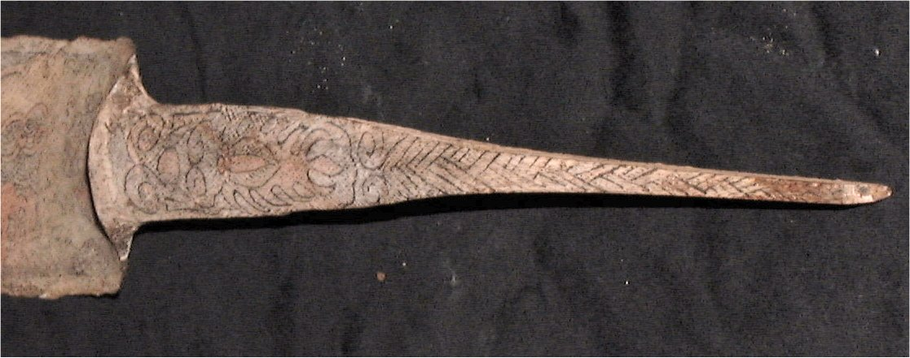  
*Basketwork pattern on the top of the siyah.*

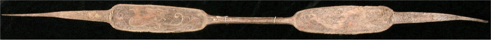  
*Two wood elements joined at the grip splice (vertical view).*

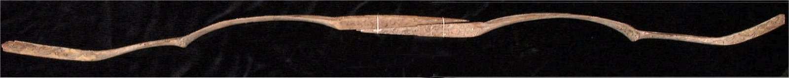  
*Two wood elements joined at the grip splice (side view).*

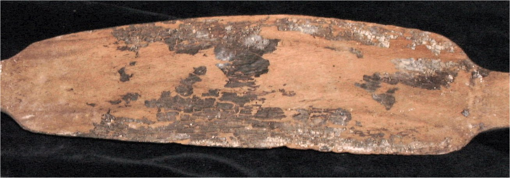  
*On the back of the main working parts of the limb, there are some
remains of blackened birch-bark.*

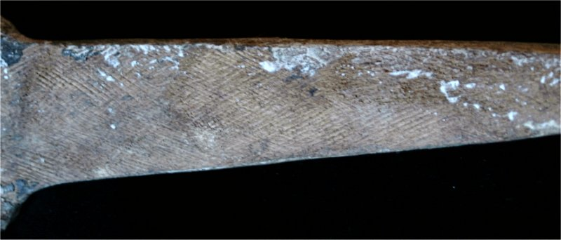  
*Scraping on the wooden surface of the bow.*

Every wooden surface of the bow - whether painted or not - has been
scraped transversely in two directions, apparently with the teeth of a
saw. I cannot work out why that should be. When wood is scraped so that
horn or sinew can be attached, it is usually just scraped in one
direction - lengthwise.

The original bow would have had bone reinforcement at the grip, and
indeed the pieces that I have shown in previous newsletters would fit
well (although they undoubtedly come from different specimens.)

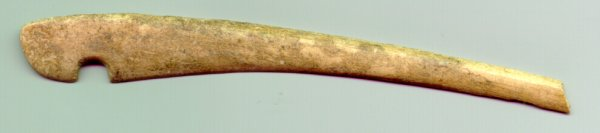  
*Bow-tip reinforcement (not found with this bow)*

  
*Bow grip reinforcement (not found with this bow)*

I was interested to see how the bone plates I discussed in the March
2002 newsletter (above) would fit to this bow. The following photographs
show how:

  
*Possible placement of the bone reinforcement for the face of the grip.*

Two years ago, I reported about the Niya bow that was discovered in
1999. Since the Niya find shared the same late horizon with the Gansu
bow - the Eastern Jin period - I was interested to see how they might
compare.

First, this is how I would reconstruct the Gansu bow:

  
*Reconstruction of the Gansu bow unstrung, with bone string-nocks and
grip-reinforcement.*

  
*Reconstruction of the Gansu bow string*

And now my reconstruction of the Niya bow for comparison:

  
*Reconstrution of the Niya bow (oblique, viewed from below)*

Clearly, there are some striking similarities between the Gansu bow and
the Niya bow. The design seems to have been very durable among the
borderland people of China, and was probably closely related to the Song
and Yuan bow designs in use in these pictures:

|                                  |                                  |
| -------------------------------- | -------------------------------- |
| 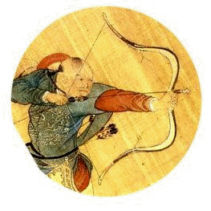 | 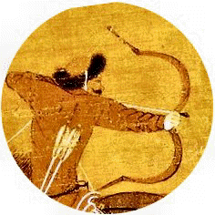 |

*This is where the SVG file comes in. I have prepared a dimensioned
drawing of the Gansu bow. If you have downloaded Adobe's SVG viewer
plug-in, you can look at  the bow and the plan in detail.*

In fact, in the same group of graves as the one from which this bow
came, there was a painted panel showing a scene of hunting with bows on
horseback.

  
*Scene of hunting with bows on horseback from the same date and location
as the Gansu bow.*

  
**Click [here](images/song_bow/gansu_bow.htm) for the detailed
dimensioned plan of the Gansu bow in SVG file format.**

I look forward to reading your views and ideas on
[ATARNet](http://www.atarn.net). Please start a new thread, 'Gansu Bow'
under 'hardware'.

 

-----

While in Xinjiang in May 2002, I was given the opportunity to study a
number of bows preserved in Xinjiang's Institute of Archaeology and the
museums at Urumqi and Turfan.

I had the chance to study three types of bow, all three of which had at
one time or another been buried like mummies in the frozen, dry sands of
the Xinjiang deserts. One of the bow groups I studied dated from the
very end of the Han Dynasty or into the Wei-Jin period. That is, from
around 250-350CE.

    On studying this group of three, almost identical bows closely, a
couple of points became immediately clear.

  - First, the description of the [Niya bow](niya.htm) in
    *"Archaeological Treasures of the Silk Road in Xinjiang Uygur
    Autonomous Region" Ed. Ma Chengyuan, Yue Feng. Shanghai Publishing
    Translation House, 1998,* in conjunction with the illustrations in
    the January 2000 edition of the Chinese archaeological journal, 'Wen
    Wu' (2000/1), had been misleading. All the illustrations had
    concentrated on a side view and had failed to do justice to the form
    of the bow when seen from the front. Furthermore, the person who did
    the drawings of the Niya bow also faithfully reproduced the effect
    of the distortion of the wood on the original item, but in the
    process gave an exaggerated impression that the length of the limbs
    were very different. In fact, optically, the limbs on these bow are
    identical in length.

  - The second point was that, clearly, the bows I was observing were
    full working bows of the same design described in my previous letter
    on the [Gansu Bow](../letters/ltr_apr02.htm). These bows show beyond
    doubt that my Gansu Bow was a full-scale model in wood of a bow that
    would normally be made of wood, sinew and horn.

The second point is of some importance in itself. Despite reading
frequently of 'model bows' placed in graves, the 'Gansu Bow' is only the
second certain example I have come across. (The first is a Liao Dynasty
wooden model of a bow and box quiver .)

My examination of the  three bows in the Museums gave me a chance to
glean some data and correct general wrong preconceptions about these
bows. However, everything I examined was behind glass and I was not
permitted to take photographs (although I could sketch to my heart's
content.) Even my measurements had to be estimated (supplemented by
earnest attempts by the archaeologists with me to recall actual
measurements.) The golden opportunity came, however, when a junk dealer
in Xinjiang sold me one half of an original bow (together with one half
of the original string and six arrows) that had come from Khotan. So
identical was this bow to those I had seen in the museums that I have no
hesitation in saying that this 'Khotan bow' provides a basis for a
detailed description of the 'Niya Bow' genus.

I have been generously helped by Mr W. F. Lai, Conservator of the Hong
Kong Museum of History. He helped with the measurement process and has
undertaken the X-ray photography. In a later newsletter, he will provide
identification of the wood and other materials used in making the bow.
At this point, I'll cut the cackle and let you see photographs of the
bow, with my observations.

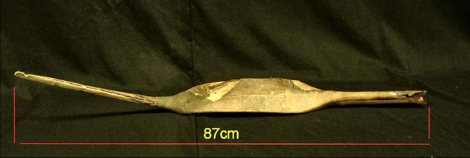  
*The half bow, oblique back view in natural lighting. The break is at
the 'right-side' grip/limb junction.*

  
*Back view. Bone limb reinforcement present on one side only. A triangle
of silk adheres to the top of the limb.*

  
*X-ray through back of the bow. (Composite of three.)*

  
*Close-up of the back of the limb. A piece of adhesive tape lies
vertically across it. The top right edge may have been scorched.*

  
*Side view of the grip, limb and siyah with surface measurements.*

  
*X-ray through grip, limb and siyah*

  
*Detail of sinew reinforcement at limb/grip junction and bone plates
reinforcing side and belly of grip.   
(The profile of the back of the grip is formed with sinew.)*

 *  
X-ray through the limb/grip junction.   
*

  
*X-ray through grip/limb transition*

  
*The belly of the limb, formed of five horn plates over wood. (Adhesive
tape across the middle.) Lowest plate is missing.*

  
*X-ray through siyah/limb transition from back.  Sinew (see picture
below) hides additional bone reinforcements .*

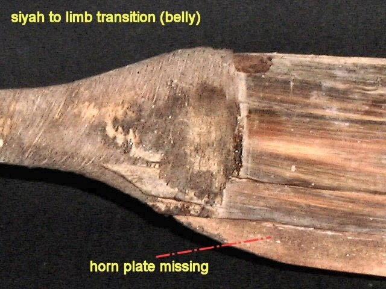  
*Detail of siyah/limb transition with sinew reinforcement.*

  
*X-ray through siyah/limb transition from side shows up an extension of
horn along the belly of the siyah.*

  
*The bow viewed from the tip looking towards the grip*

  
*Looking from the grip to the siyah*

  
*The bone reinforcement to the tip/siyah. I surmise that the extent of
the wooden core was originally the same as the bone reinforcement.*

  
*This photograph provides clues to the construction of the grip/limb
transition.*

  
*Cotton thread  tied at measured intervals, with contour gauge readings
from the back (and belly at D, E.)*

  
*X-ray through grip from the back shows splice of limb/grip and
interstitial wood insert in the grip. *

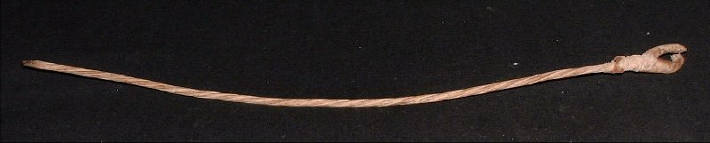  
*What remains of the original string. *

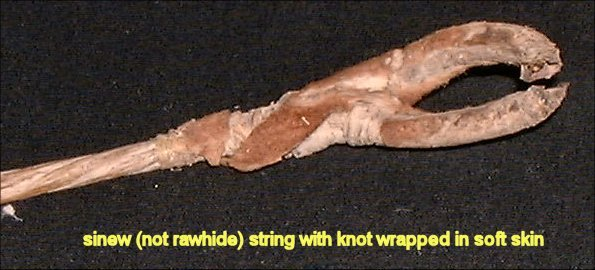  
*The loop seems to have been formed like a modern bow string and then
wrapped in the skin of a small, furry animal.*

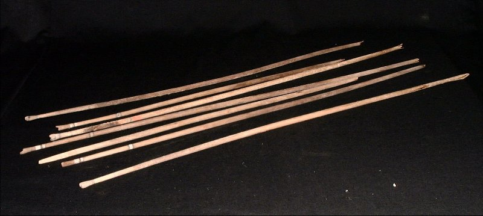  
*Six original self wooden arrows. But the points have all been snapped
off before burial. *

*Arrow Measurements  *

|            |                   |                   |
| :--------: | :---------------: | :---------------: |
| Length(cm) | Max. diameter(cm) | Min. Diameter(cm) |
|    80.4    |       0.995       |       0.770       |
|    74.4    |       0.910       |       0.610       |
|    60.6    |       0.910       |       0.605       |
|    76.8    |       0.910       |       0.605       |
|    75.8    |       0.910       |       0.605       |
|    61.0    |       0.895       |       0.715       |
|    78.4    |       0.905       |       0.710       |

  
*Self-wood bulbous nock. Painted, but no sign of reinforcement or
inserts.*

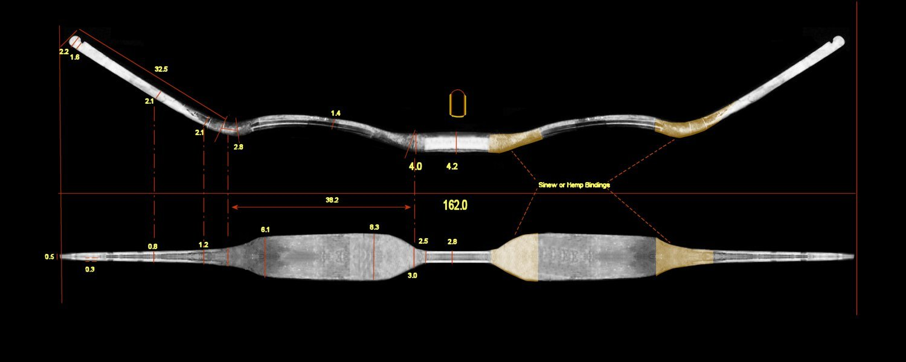  
*Here, I use computer magic to repair the bow and supply dimensions.
This exercise assumes symmetry around two axes.*

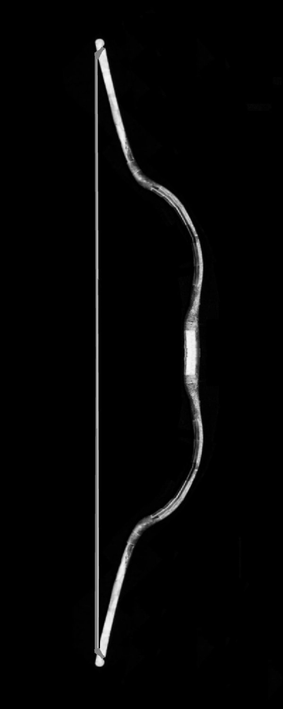  
*More computer magic: ready to shoot\!*

-----

***Archaeological and historical background of the Khotan bows.***

A bow of identical design to the one I have just described was excavated
at Niya on 11 October 1995. A coffin containing four male mummies and
two bows was exhumed unopened and then examined in relatively ideal
laboratory conditions in Urumqi in the following months. The description
of the contents of the coffin from grave \#4 at cemetery \#95 at Niya
was published in "Xinjiang Wenwu" ('Xinjiang Cultural Relics') Issue No.
2 of 1999, p. 27. There is some further comment in Wang Binghua (with
Victor H. Mair), "The Ancient Corpses of Xinjiang", Xinjiang People's
Press, 2002. ISBN 7-228-05161-0. Further background information (in
Chinese) and illustrations is provided in Liu Wei: "Chinese Civilization
in a New Light" Vol. 4. Commercial Press, Hong Kong, 2001. ISBN
962-07-5307-0.

The Niya site corresponds geographically to the location of a culture
which occupied the Niya area throughout the Eastern Han and Western Jin
periods, around 200-350CE. Situated in the remote desert, Niya was once
irrigated by the Niya river, fed by the melting snows of the Kunlun
Mountains. 

In Chinese literature, the people occupying that region in those times
were known as the 'Jingjue' (精絕). The 'Official History of the Han:
Record of the Western Regions' (漢書西域傳) records that the Jingjue were one
of 36 large and small vassal states in the West of the Empire. 480
households with a total population of over 3,000 people were recorded.
Their armed forces amounted to 500 men. The Han government posted four
officials there for administrative purposes. An invasion of the region
by the Tuguhun in the fifth century caused economic disruption. Water
supply to the Niya river was cut of and the desert encroached.
(Archaeological surveys by Aurel Stein in the 19th Century and surveys
by Chinese and Japanese archaeologists since the 1950s suggest, however,
that the area was abandoned over a rather short period, with many
valuable items left scattered.) By the time that the Tang monk-explorer
Xuanzhang passed the site in the 7th Century, it was already a ruin.

The mummified remains from Cemetery \#95 generally display non-Chinese
racial characteristics, with light brown or blond hair and high,
aquiline noses. Men were around 1.65 meters tall. They lived in a
prosperous community which enjoyed the best luxury products from both
East and West. Foods preserved in graves show that their diet was mainly
mutton, grains and dried fruits (in fact, much the same as present-day
inhabitants of the region.) Particularly striking (partly because their
spectacular state of preservation) are the embroidered cloths in silk
and wool that the mummies are buried in. The people were literate. In
common with other cultures in the region at that time, they kept civil
records in the Kharoşţh-ī-Prakrit script, that originated in Northern
India.

Several of the deceased at Niya had died violently. Males were buried
together with grave goods which in most cases included a bow, bow-case,
quiver and arrows. Bows were clearly standard, emblematic burial items
for males. Most of the bows were composite bows such as the one
described here; but simple wood self bows about 1.5m long were also
found. Arrows were self wood barreled and either had blunt wooden
points, or else had had metal arrowheads removed before burial. Women
were buried with make-up kits and items related to sewing and weaving.
Where coffins were placed above previous burials, the previous burials
were sometimes burned.

Coffin \#4 from cemetery \#95 also contained a piece of brocade with a
vivid design of mounted archers using bows that were consistent with the
design of the bow described here. Another mummy discovered nearby had a
brocade bracer on his arm, embroidered with the Chinese text "Five stars
appear in the East: the Central States will benefit and the Southern
Qiang will be punished." This brocade may be a gift from the Chinese
court to minority tribes who helped the Chinese to suppress incursions
from the Southern Qiang (Tibetans.)

  
*A piece of brocade with a vivid design of mounted archers using bows
consistent with the design of the bow described here.  
(Based on an illustration in Xinjiang Wenwu" ('Xinjiang Cultural
Relics') Issue No. 2 of 1999.)  
You may copy and make non-commercial use of this drawing.*

-----

***Commentary***

Feeling a sense of déja-vu? Open 'The Traditional Bowyer's Bible', Vol.
3 at page 82. Look at Tim Baker's suggestion for a theoretical design
for maximized performance of a composite bow. Someone got around to
trying out his design... 1,700 years ago.

In this bow design, the working limbs amount to little more than
spring-leaf hinges. From the X-rays, we can see that the bow needed
careful reinforcement at the edges of regions where the working sections
and non-working sections are spliced. We also see that the central horn
plate of the belly extends half-way up the siyah. As far as can be
ascertained, the wooden core consists of two pieces of wood, each carved
in one piece from the tip to the grip, with a short interstitial piece
of wood between them.

While Tim Baker anticipates the short, rectangular working limb, he does
not anticipate the spoon-shaped hollowing of the limbs (which is
corroborated by the Gansu bow.) Without actually constructing this bow,
it is difficult to understand the purpose of such a feature. Personally,
I could imagine the hollow-profile  limb giving rises to enormous
stresses at the edges. What happened in reality?

One element of the design helps to deal with a problem that we observed
in the area where these bows were made: there is little prospect of
obtaining long sections of good, consistent horn and the principal woods
are light and lack hardness and sappiness. The short working limb
permits the use of short plates of horn. The addition of slivers of bone
(horse or camel) as reinforcement allows construction of very light but
strong non-working sections. I would go as far as to say that this bow
is principally constructed of bone, horn and sinew: the role of the wood
core in the construction is limited to a scaffolding to facilitate the
assembly of the other materials.

For a further interactive discussion of this bow, please look for the
new discussion topic on
[ATARNet](http://www.atarn.org/cgi-local/anyboard.cgi/atarnet01?cmd=get&cG=13031323&zu=31303132&v=2&gV=0&p=).

(Follow-up discussion up to 21 July 2002 can be seen
[here](../letters/khotan_bow/khotan_discuss.htm).)

-----

Last edited 20 November 2002
